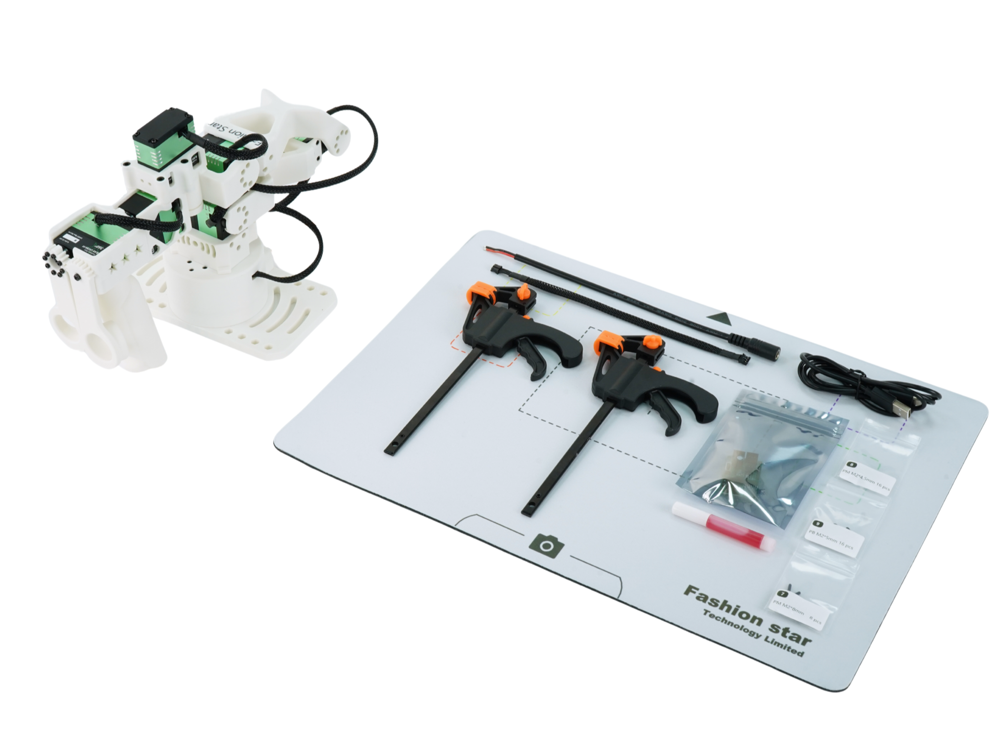

# Star Arm 102 - 机械臂遥操作系统
<p align="right">
  <strong>Language / 语言:</strong>
  <a href="./README.md">中文</a> |
  <a href="./README_EN.md">English</a>
</p>


---

## 📖 项目简介（
了解 Star Arm 102 全系列：
[Star Arm 102 机械臂 — 系列总览](https://fashionstar.com.cn/robot-arm/star-arm-102/)

## 🛒 购买渠道
- [Star Arm 102-LD — LeRobot 认证 Leader 主臂](https://fashionstar.com.cn/store/product/star-arm-102-ld/)
- [Star Arm 102-HD — 一键悬停 Leader 主臂](https://fashionstar.com.cn/store/product/star-arm-102-hd/)
- [Star Arm 102-FL — Follower 从臂](https://fashionstar.com.cn/store/product/star-arm-102-fl/)
- [淘宝购买](https://item.taobao.com/item.htm?ft=t&id=1045277992605)：推荐中国大陆用户购买

## 🔗 相关链接
- [华馨京科技｜FashionStar 官网](https://fashionstar.com.cn/)

### ✨ 核心特性

- 🔓 **开源 · 低成本 · 灵活获取**
  

完全开源的设计，降低学习与使用门槛

提供两种获取方式：购买预装整机（开箱即用），或自行打印组装（需打印并购买零件，适合教学与动手实践）

- ⚙️ **机械臂构型科学**
  

6个主动关节 + 1个末端执行器

关节构型严格满足 Pieper 准则，支持逆运动学解析法求解，算法透明、易于教学与二次开发

- 🔗 **LD 型号：高兼容性遥操主手**

Star Arm 102‑LD 不仅能丝滑遥操同系列 FL 型号

还可直接兼容 reBot 及其他同构型或相似构型的机械臂

一套主手，多臂通用，提供更丝滑的遥操体验

- 🔒 **HD 型号：支持一键锁定的增强主手**

Star Arm 102-HD 是 Star Arm 102 系列即将推出的新主臂型号

相比 LD 型号，HD 增加了一键锁定功能：按下锁定按键后，主臂可在当前姿态锁定，从臂同步进入锁定状态；再次按下按键后解除锁定

- 🕹️ **多平台兼容 · 即连即用**
  

支持Python SDK直接遥操

深度兼容 LeRobot 与 ROS2 生态

覆盖真实机器人应用全流程：数据采集 → 仿真模拟 → 模型训练 → 实物部署

- 📚 **完整学习资源**

提供从入门到进阶的教程、API 文档、示例代码

适合高校教学、科研实验及个人开发者自学

---

## 🔧 手臂规格

||Star Arm 102\-HD|Star Arm 102\-LD|Star Arm 102\-FL|
|---|---|---|---|
|臂展|420mm|420mm|420mm|
|自由度|6\+1|6\+1|6\+1|
|重复精度|\-|\-|±0\.5mm|
|建议最大负载|\-|\-|500g|
|关节范围<br>|关节 1: ±110°<br>关节 2: 0°\~180°<br>关节 3: 0°\~270°<br>关节 4: ±90°<br>关节 5: ±65°<br>关节 6: ±150°<br>手柄: 0\~90|关节 1: ±110°<br>关节 2: 0°\~180°<br>关节 3: 0°\~270°<br>关节 4: ±90°<br>关节 5: ±65°<br>关节 6: ±150°<br>手柄: 0\~90°|关节 1: ±110°<br>关节 2: 0°\~180°<br>关节 3: 0°\~270°<br>关节 4: ±90°<br>关节 5: ±65°<br>关节 6: ±150°<br>夹爪: 0\~90|
|舵机配置|关节 1\-4（舵机 ID 0\-3）使用 RP8\-U45H\-M；<br>关节 5（舵机 ID 4）使用 RP8\-U45H\-M\-C029；<br>关节 6 与手柄关节（舵机 ID 5\-6）使用 RP8\-U45H\-M\-C028；|关节 1\-4（舵机 ID 0\-3）使用 RA8\-U01H\-M；<br>关节 5（舵机 ID 4）使用 RA8\-U02H\-M；<br>关节 6 与手柄关节（舵机 ID 5\-6）使用 RA8\-U03H\-M；|关节 1、4、7 与夹爪关节（舵机 ID 0、3、6）使用 RA8\-U35H\-M；<br>关节 2、3（舵机 ID 1\-2）使用 RX8\-U50H\-M；<br>关节 5（舵机 ID 4）使用 RA8\-U27H\-M-C005；<br>关节 6（舵机 ID 5）使用 RA8-U35H-M-C047；|
|通讯集线器|UC\-01|UC\-01|UC\-01|
|通信方式|UART|UART|UART|
|电源规格|12V10A / XT30|12V3A / DC5521|12V10A / XT30|
|配件|螺丝、螺纹胶、木工夹x2、备用 PCB（UC01）、DC 电源转接线（5\.5×2\.1mm 接头）、200mm 舵机延长线、USB\-A 转 USB\-C 线、鼠标垫、底托|螺丝、螺纹胶、木工夹x2、备用 PCB（UC01）、XT30 电源转接线、200mm 舵机延长线、USB\-A 转 USB\-C 线、鼠标垫、底托|螺丝、螺纹胶、木工夹x2、备用 PCB（UC01）、DC 电源转接线（5\.5×2\.1mm 接头）、200mm 舵机延长线、USB\-A 转 USB\-C 线、鼠标垫|
|编码器|12\-bit magnetic encoder|12\-bit magnetic encoder|12\-bit magnetic encoder|
|重量|883g|721g|791g|
|推荐工作温度|0\-40℃|0\-40℃|0\-40℃|
|支持按键锁定|✓ |×|\-|
|支持Lerobot|✓ |✓ |✓ |
|支持ROS 2 |✓ |✓ |✓ |
|支持MoveIt |\-|\-|✓ |
|支持Gazebo |\-|\-|✓ |

---

## 🔧硬件资料

<p align="center">
  
</p>


- [Parts List](./Hardware/README.md): 查看完整零件清单、数量和配件

- [Engineering Drawings](./Hardware/cad/README.md): 查看总装图、和制造图纸

- [Assembly Guide](./Hardware/assembly/README.md): 查看装配顺序、注意事项和配图说明(等待完善中)

- [MakerWorld Models](https://makerworld.com.cn/zh/models/2366043-xing-bi-102-ld?from=search#profileId-2682765): 下载Star Arm 102-LD的3D打印文件，可自行替换或者组装机械臂

> Star Arm 102-HD 的锁定功能按键板固件与说明位于 `Star-Arm-102-dev-main` 工程中。按键板默认使用 ID 7，主机模式下可直接发送锁定 / 解锁控制；从机模式下可作为模拟舵机被主机轮询，返回 0.0° / 180.0° 表示解锁 / 锁定状态。

---

## 🚀 快速开始

### 环境要求

| 项目 | 要求 |
|------|------|
| 操作系统 | Ubuntu 22.04 |
| ROS版本 | ROS2 Humble |
| 硬件设备 | StarArm 102 机械臂 (Leader/HD + Follower) |
| 驱动程序 | [CH340 USB驱动](https://www.wch.cn/downloads/CH341SER_EXE.html) |

### 安装步骤

#### 方式一：Python裸机控制机械臂遥操（推荐新手）

```bash
# 1. 安装依赖
pip install pyserial fashionstar-uart-sdk

# 2. 运行程序
sudo chmod 777 /dev/ttyUSB*
python3 ./Python_SDK/stararm102_ro.py
```

#### 方式二：ROS2 HUMBLE

```bash
# 参考 ROS2_HUMBLE/README.md 配置说明
```

#### 方式三：Lerobot 框架

```bash
# 参考 Lerobot/README.md 配置说明
```

---

## 📂 项目结构

<details>
<summary>展开查看项目结构</summary>

```text
Star-Arm-102/
|-- .gitignore                               # Git 忽略规则
|-- Hardware/                                # 硬件资料
|   |-- assembly/                            # 装配说明
|   |-- cad/                                 # CAD 模型与工程图纸说明
|   |-- parts/                               # 零件清单与 BOM
|   `-- README.md                            # 硬件总览
|-- Lerobot/                                 # LeRobot 框架控制方式
|   |-- lerobot-robot-stararm102/            # Follower 机器人配置
|   |-- lerobot-teleoperator-stararm102/     # Leader 遥操作器
|   |-- lerobot-stararm102/                  # 新版 StarArm102 LeRobot 插件包
|   |   |-- examples/                        # 状态读取与主从回放示例
|   |   |-- lerobot_teleoperator_stararm102/ # HD/FL 设备配置与驱动实现
|   |   |-- pyproject.toml                   # Python 包配置
|   |   `-- README.md                        # 插件包使用说明
|   |-- media/                               # LeRobot 文档媒体资源
|   |-- stararm102_en.md                     # LeRobot 使用文档（英文）
|   |-- stararm102.md                        # LeRobot 使用文档
|   `-- README.md                            # 使用步骤
|-- Media/                                   # README 与文档使用的图片资源
|   |-- images/                              # 图片资源
|   `-- video/                               # 视频资源
|-- Python_SDK/                              # Python SDK 控制方式
|   |-- stararm102_ro.py                     # 主从控制程序，支持 LD/HD 配置
|   |-- stararm102_ro_hover.py               # 悬停 / 锁定控制示例程序
|   `-- PYTHON_SDK_GUIDE.md                  # Python SDK 详细使用文档
|-- ROS2_HUMBLE/                             # ROS2 控制方式
|   `-- src/
|       |-- arm_moveit_read/                 # 位姿读取节点
|       |-- arm_moveit_write/                # 位姿写入节点
|       |-- arm_read_pose/                   # 实时位姿读取
|       |-- robo_driver/                     # 机械臂硬件驱动节点
|       |-- robo_interfaces/                 # 自定义 ROS2 接口
|       |-- ros2_bag_recorder/               # 示教轨迹录制
|       |-- stararm102_controller/           # 机械臂控制器
|       |-- stararm102_description/          # 机械臂 URDF 模型描述
|       |-- stararm102_gazebo/               # Gazebo 仿真环境配置
|       `-- stararm102_moveit_config/        # MoveIt 2 运动规划配置
|-- README.md                                # 中文说明文档
`-- README_EN.md                             # English README
```

</details>

---

## 🎯 控制方式对比

| 特性 | Python SDK | ROS2 HUMBLE | Lerobot |
|------|------------|-------------|---------|
| 难度 | ⭐ 简单 | ⭐⭐⭐ 中等 | ⭐⭐⭐⭐⭐ 复杂 |
| 实时性 | ⭐⭐⭐⭐⭐ | ⭐⭐⭐ | ⭐⭐⭐ |
| 扩展性 | ⭐⭐ | ⭐⭐⭐⭐⭐ | ⭐⭐⭐⭐ |
| 适用场景 | 快速测试、教学 | 机器人系统集成 | AI训练、研究 |

---

## 🔧 硬件连接

### 连接拓扑

```bash
                    ┌─────────────────┐
                    │                 │
                    │      计算机      │
                    │ (Ubuntu 22.04)  │
                    └────────┬────────┘
                             │
              ┌──────────────┼──────────────┐
             USB                           USB
              │                             │
       ┌──────┴──────┐               ┌──────┴────────┐
       │             │               │               │
       │ Leader Arm  │               │ Follower Arm  │
       │(StarArm 102)│               │ (StarArm 102) │
       └─────────────┘               └───────────────┘
```

### 设备识别

```bash
# 查看所有 USB 设备
lsusb

# 查看串口设备
ls -l /dev/ttyUSB*

# 赋予权限
sudo chmod 777 /dev/ttyUSB*
```

---

## 📊 关节映射

StarArm102 机械臂共有 7 个关节（6个自由度 + 1个旋转夹爪）。文档中的关节编号从 1 开始，代码与舵机总线中的舵机 ID 从 0 开始，两者映射如下：

| 功能关节 | 代码关节名 | 舵机 ID | 角度范围 | 说明 |
|------|------|------|----------|------|
| 关节 1 | Joint1 | 0 | -110° ~ 110° | 底座旋转 |
| 关节 2 | Joint2 | 1 | 0° ~ 180° | 肩部俯仰 |
| 关节 3 | Joint3 | 2 | 0° ~ 270° | 肘部俯仰 |
| 关节 4 | Joint4 | 3 | -90° ~ 90° | 手腕旋转 |
| 关节 5 | Joint5 | 4 | -65° ~ 65° | 手腕偏航 |
| 关节 6 | Joint6 | 5 | -150° ~ 150° | 手腕旋转 |
| 夹爪 / 关节 7 | Gripper (joint7_left) | 6 | 0° ~ 90° | 旋转夹爪 |

> 📝 **注意**：旋转夹爪通过 `joint7_left` 控制，`joint7_right` 为联动关节，自动反向同步。

---

## ⚠️ 安全注意事项

1. **操作前检查**：确保机械臂周围无障碍物，工作空间安全
2. **急停控制**：程序运行时按 `Ctrl+C` 可立即停止
3. **关节限制**：系统已自动设置安全角度限制，避免越界运动
4. **电源管理**：确保机械臂供电稳定，避免电压波动

---

## 🐛 故障排除

### 常见问题

**Q1: 找不到 `/dev/ttyUSB0` 设备？**

```bash
# 检查 USB 设备
ls -l /dev/ttyUSB*

# 检查 USB 设备信息
lsusb

# 查看串口日志
sudo dmesg | grep ttyUSB

# 如果被 brltty 占用，卸载它
sudo apt remove brltty

# 赋予权限
sudo chmod 777 /dev/ttyUSB*
```

**Q2: 串口连接失败？**

- 检查 USB 线是否松动
- 确认机械臂电源已开启
- 尝试更换 USB 端口
- 检查驱动是否正常安装

**Q3: 控制频率过低？**

- 检查串口通信是否正常
- 减少其他程序运行负载
- 使用 USB 3.0 端口以提高速度

**Q4: 机械臂连接失败？**

- 检查 USB 线连接是否松动
- 确认机械臂电源已开启
- 检查舵机通信状态
- 尝试更换 USB 端口

---

## 📖 详细文档

选择你需要的控制方式查看详细文档：

- 📘 **[Python SDK 详细文档](./Python_SDK/PYTHON_SDK_GUIDE.md)** - 推荐！最简单易用
- 📗 **[ROS2 HUMBLE 详细文档](./ROS2_HUMBLE/README.md)** - 适用于机器人系统集成
- 📙 **[Lerobot 详细文档](./Lerobot/README.md)** - 适用于AI训练和研究

## 📄 许可证

本项目基于 [MIT License](LICENSE) 开源。

---

## 👥 致谢

- **感谢**：华馨京科技（FashionStar）提供硬件支持和 SDK

---

## 🔗 相关链接

- [华馨京科技｜FashionStar 官网](https://fashionrobo.com/)
- [Lerobot 框架](https://github.com/huggingface/lerobot)
- [ROS2 官方文档](https://docs.ros.org/en/humble/)
- [MoveIt2 官方文档](https://moveit.picknik.ai/humble/)

